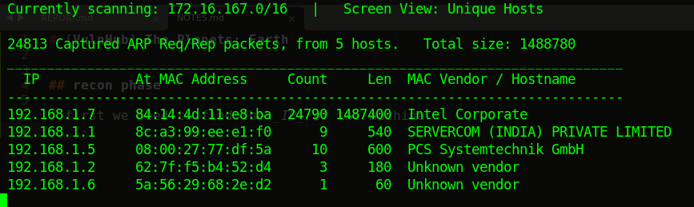
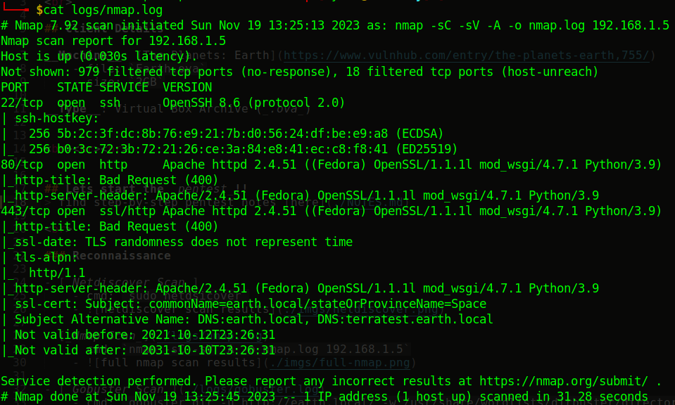
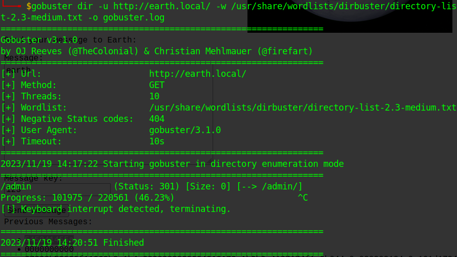

<h1 align='center'> [VH] The Planets: Earth </h1>

 

## Client Details

__Machine__: [The Planets: Earth](https://www.vulnhub.com/entry/the-planets-earth,755/)  
	- file: `Earth.ova`  
	- size: `2GB`

__Type__: Virtual Box Archive (_.ova_)

 
 

## Lets start the _pentest_!!
> find step-by-step pentest notes [here](./NOTES.md)

 

### Reconnaissance

- [_Netdiscover Scan_]
	- cmd: `sudo netdsicover`
	- 

- [_Nmap Scan_](./logs/nmap.log)
	- cmd: `nmap -sC -sV -A -o nmap.log 192.168.1.5`
	- 

- [_Gobuster Scan_](./logs/gobuster.log)
	- cmd: `gobuster dir -u http://earth.local/ -w /usr/share/wordlists/dirbuster/directory-list-2.3-medium.txt -o gobuster.log`
	- 

- Found `https://terratest.earth.local` > [`/robots.txt`](./files/robots.txt) > [`/testingnotes.txt`](./files/testingnotes.txt) > [`/testdata.txt`](./files/testdata.txt)

 

### Gaining Access

- Got website _login creds_ (for `http://earth.local/admin/login`):
	- _username_: `terra`
	- _password_: `earthclimatechangebad4humans`

- __Successfully logged into _Admin Command Tool_!__

- __Successfully got a _Reverse Shell_!!__

- Found `/var/earth_web/user_flag.txt` > `[user_flag_3353b67d6437f07ba7d34afd7d2fc27d]`

- Found a vuln binary: `/usr/bin/reset_root`

- _Root Credentials_:
	- _username_: `root`
	- _password_: `Earth`

- Found `/root/root_flag.txt` > `[root_flag_b0da9554d29db2117b02aa8b66ec492e]`

 

## Conclusion

- Currently we have full __root privilages__
- Next things to try:
	- _maintaining access_
	- _clearing tracks_
 

#### HAPPY HACKING ;)
